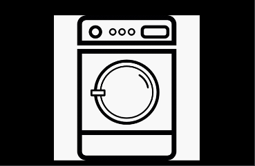

WashIt er et vaskeri som ønsker seg et fleksibelt og effektivt system slik at sluttbrukerne kan reservere vasketid og få varsel når en vaskemaskin blir ledig.
Idag har WashIt 12 vaskemaskiner med 3 typer vaskeprogram, som er best definert av temperatur og lengde på vaskeprogrammet:
Kokvask: 60 grader, 90 minutter
Tøyvask: 40 grader, 60 minutter
Håndvask: 30 grader, 20 minutter
Idag bruker WashIt et manuelt system hvor man skriver seg opp på en liste og reserverer en vaskemaskin for en time av gangen. Dette systemet kan gi mye dødtid hvor vaskemaskinene ikke brukes, for eksempel hvis sluttbrukerne ikke bruker sin reserverte vasketid, eller hvis de setter på et vaskeprogram som tar kortere tid enn den tiden de har reservert.
WashIt ønsker et system hvor
-	sluttbrukerne skal kunne reservere vaskemaskiner ved å angi type vask
-	sluttbrukerne skal kunne enkelt avlyse reservasjon
-	sluttbrukere skal kunne sette seg på venteliste og motta varsel hvis en vaskemaskin blir ledig for deres type vask.

Del 1:
Du skal utvikle en applikasjon som inneholder de nødvendige komponentene som beskrevet ovenfor, og som er nødvendig for at denne skal fungere.

Del 2:
WashIt vil utvide applikasjonen til å inkludere flere tjenester. Eksempelvis:
-	Identifisering av sluttbruker, slik at kun den som har reservert vaskemaskinen kan bruke den.
-	Innsjekk for sluttbruker. Reservasjonen kanselleres etter 15 minutter hvis sluttbrukeren ikke har sjekket inn eller startet maskinen.
-	Reservasjon av tørketromler

Beskriv hvordan du ser for deg å utvide applikasjonen med funksjonaliteten beskrevet ovenfor.

Swagger served at: http://localhost:8080/swagger-ui/#/